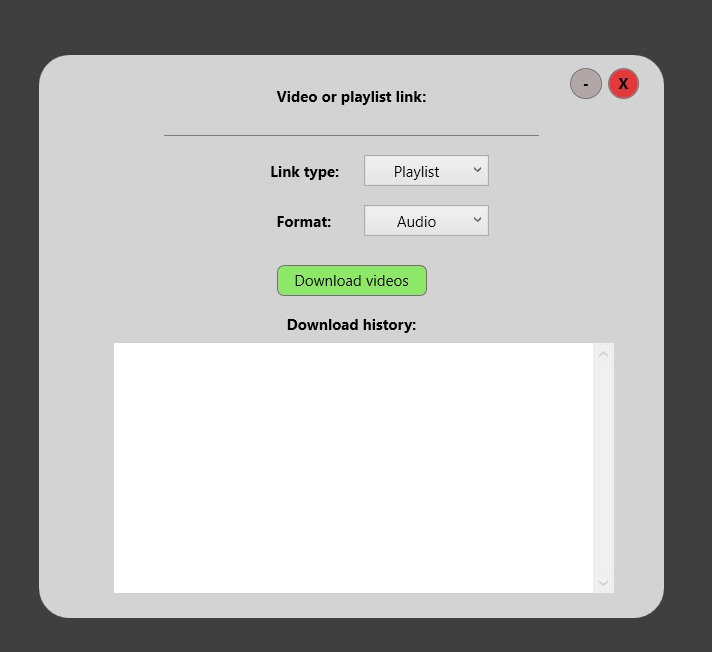

# Youtube Downloader made in C# WPF
The app is using [YoutubeExplode](https://github.com/Tyrrrz/YoutubeExplode) nuget package for interacting with youtube api and [Ookie Dialogs](https://www.ookii.org/software/dialogs/) for better folder selection dialog

## Features:
- Select between playlist or video downloading
- Select between mp3 (Only audio) or mp4 (Audio/Video) output

# App screenshot

